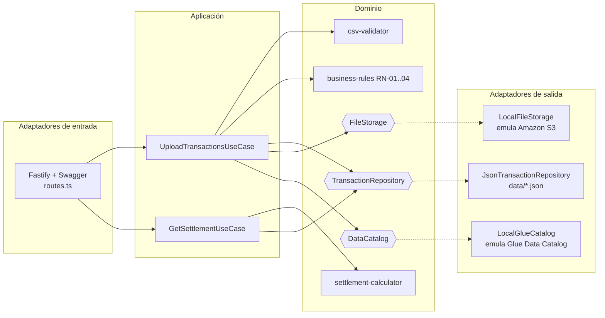

# FinCard — Módulo de Liquidación de Puntos y Aliados

Solución de la prueba técnica: API en **Node.js 20 + TypeScript + Fastify** con
**Arquitectura Hexagonal (Ports & Adapters)** para la carga, validación y
liquidación de transacciones de puntos de los aliados comerciales de FinCard.

## Requisitos

- Node.js >= 20 (probado con v20.19.x)
- npm

## Ejecución local

```bash
npm install
npm run dev          # servidor en http://localhost:3000
```

Documentación Swagger interactiva: **http://localhost:3000/docs**

### Compilar y ejecutar en producción

```bash
npm run build
npm start
```

### Docker

```bash
docker build -t fincard-loyalty .
docker run -p 3000:3000 fincard-loyalty
```

### Pruebas

```bash
npm test                 # unitarias + integración
npm run test:coverage    # con reporte de cobertura (umbral mínimo: 80%)
npm run lint             # ESLint (incluye límite de complejidad ciclomática)
npm run typecheck        # verificación de tipos
```

## Probar con los datos de ejemplo

```bash
# Cargar el CSV de ejemplo (incluye casos borde: IDs inválidos, duplicados,
# puntos negativos, fecha futura y exceso de 10,000 puntos diarios)
curl -X POST http://localhost:3000/api/v1/transactions/upload \
  -F "file=@sample-data/transactions-sample.csv"

# Consultar la liquidación de un aliado
curl "http://localhost:3000/api/v1/settlements/PART01?from=2026-07-01&to=2026-07-31"
```

## Endpoints

| Método | Ruta | Descripción |
| ------ | ---- | ----------- |
| POST | `/api/v1/transactions/upload` | Carga de archivo CSV de transacciones (RF-01, RF-02, RF-03, RF-05) |
| GET | `/api/v1/settlements/{partner_id}?from=&to=` | Resumen de liquidación por aliado (RF-04) |
| GET | `/docs` | Documentación Swagger/OpenAPI |

## Arquitectura

Se implementó **Arquitectura Hexagonal (Ports & Adapters)**. El dominio y los
casos de uso no dependen de ninguna tecnología concreta: solo conocen
*puertos* (interfaces). Los *adaptadores* (Fastify, sistema de archivos, JSON)
implementan esos puertos y se inyectan en el arranque (composition root).



### Estructura de carpetas

```
src/
├── domain/            # Núcleo: entidades, servicios puros y puertos (interfaces)
│   ├── entities/
│   ├── services/      # Validación CSV, reglas RN-01..RN-04, cálculo de liquidación
│   └── ports/         # TransactionRepository, FileStorage, DataCatalog
├── application/       # Casos de uso (orquestan dominio + puertos)
└── infrastructure/    # Adaptadores concretos
    ├── http/          # Fastify, rutas, esquemas Swagger, manejo de errores
    ├── persistence/   # Repositorio JSON (tablas transactions y transactions_flagged)
    ├── storage/       # "S3" local: storage/fincard-transactions/{year}/{month}/{partner_id}/
    └── catalog/       # "Glue" local: data/glue-catalog.json
```

### Justificación

- **Testabilidad**: el dominio se prueba con funciones puras y los casos de uso
  con adaptadores en memoria; la cobertura supera el 80% sin necesidad de AWS.
- **Migración a AWS sin reescritura**: para producción basta con implementar
  `FileStorage` con `@aws-sdk/client-s3` y `DataCatalog` con
  `@aws-sdk/client-glue`, e inyectarlos en `server.ts`. El dominio no cambia.
- **Complejidad ciclomática baja**: cada regla de negocio y cada validación es
  una función pequeña e independiente; ESLint impone `complexity <= 8`.

## Tecnologías

- **Fastify 5**: framework HTTP con validación por esquemas JSON.
- **@fastify/swagger + swagger-ui**: documentación OpenAPI generada de los esquemas.
- **csv-parse**: parseo robusto de CSV.
- **Jest + ts-jest + supertest/inject**: pruebas unitarias y de integración.
- **ESLint + typescript-eslint**: calidad de código y límite de complejidad.

## Decisiones y supuestos (ver también `docs/ADR.md`)

1. **Carga parcial con reporte de errores**: si el archivo mezcla filas válidas
   e inválidas, las válidas se procesan y la respuesta es `400` con el detalle
   de cada error por fila (requisito RF-01) más el manifiesto. Si todas las
   filas son válidas la respuesta es `201`.
2. **RN-02**: cuando un aliado supera el 30% de transacciones diarias con
   redención, se marcan las transacciones de redención que exceden el umbral
   (en orden de aparición), no todo el día.
3. **Neto negativo**: el reporte muestra `net_points_owed = 0` cuando el neto
   es negativo, pero el valor real se conserva internamente
   (`internalNetPoints` en el modelo de dominio).
4. **Emulación local de AWS**: S3 se emula con el sistema de archivos
   (`storage/`) y Glue con un JSON (`data/glue-catalog.json`), tal como permite
   el enunciado. Los puertos aíslan esta decisión.

## Despliegue en AWS (siguiente fase)

El diseño está preparado para desplegar en AWS:

- **Contenedor**: el `Dockerfile` multi-stage permite desplegar en ECS Fargate
  (o App Runner) detrás de un ALB.
- **Adaptadores reales**: `S3FileStorage` (AWS SDK v3) y `GlueDataCatalog`
  reemplazan a los locales vía configuración.
- **IaC**: se sugiere Terraform/CDK con: bucket S3 `fincard-transactions`,
  base de datos Glue `fincard_loyalty`, servicio ECS y roles IAM de mínimo
  privilegio.

## SQL Avanzado

Ver [`queries/optimization.sql`](queries/optimization.sql): liquidación mensual
en Redshift, versión optimizada para Athena/Parquet con estrategias de
reducción de costos y plan de particionamiento, y detección de anomalías
(>50% de cambio mensual) con funciones de ventana.
