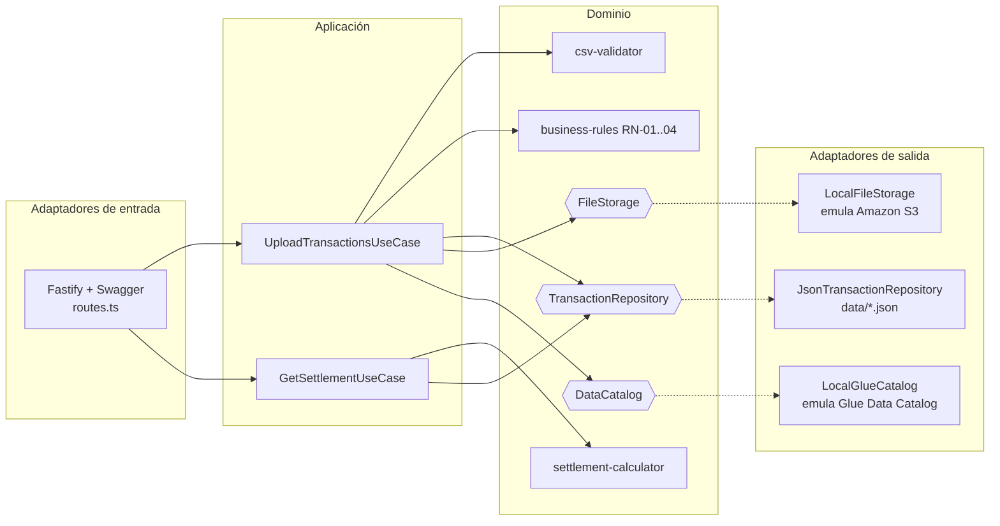

# FinCard — Módulo de Liquidación de Puntos y Aliados

Solución de la prueba técnica: API en **Node.js 20 + TypeScript + Fastify** con
**Arquitectura Hexagonal (Ports & Adapters)** para la carga, validación y
liquidación de transacciones de puntos de los aliados comerciales de FinCard.

## Requisitos

- Node.js >= 20 (probado con v20.19.x)
- npm

## Ejecución local

```bash
npm install
npm run dev          # servidor en http://localhost:3000
```

Documentación Swagger interactiva: **http://localhost:3000/docs**

### Compilar y ejecutar en producción

```bash
npm run build
npm start
```

### Docker

```bash
docker build -t fincard-loyalty .
docker run -p 3000:3000 fincard-loyalty
```

### Pruebas

Pruebas unitarias con una cobertura mayor al 80% 

```bash
npm test                 # unitarias + integración
npm run test:coverage    # con reporte de cobertura (umbral mínimo: 80%)
npm run lint             # ESLint (incluye límite de complejidad ciclomática)
npm run typecheck        # verificación de tipos
```

## Probar con los datos de ejemplo

```bash
# Cargar el CSV de ejemplo (incluye casos borde: IDs inválidos, duplicados,
# puntos negativos, fecha futura y exceso de 10,000 puntos diarios)
curl -X POST http://localhost:3000/api/v1/transactions/upload \
  -F "file=@sample-data/transactions-sample.csv"

# Consultar la liquidación de un aliado
curl "http://localhost:3000/api/v1/settlements/PART01?from=2026-07-01&to=2026-07-31"
```

## Endpoints

| Método | Ruta | Descripción |
| ------ | ---- | ----------- |
| POST | `/api/v1/transactions/upload` | Carga de archivo CSV de transacciones (RF-01, RF-02, RF-03, RF-05) |
| GET | `/api/v1/settlements/{partner_id}?from=&to=` | Resumen de liquidación por aliado (RF-04) |
| GET | `/docs` | Documentación Swagger/OpenAPI |

## Arquitectura

Se implementó **Arquitectura Hexagonal (Ports & Adapters)**. El dominio y los
casos de uso no dependen de ninguna tecnología concreta: solo conocen
*puertos* (interfaces). Los *adaptadores* (Fastify, sistema de archivos, JSON)
implementan esos puertos y se inyectan en el arranque (composition root).



### Estructura de carpetas

```
src/
├── domain/            # Núcleo: entidades, servicios puros y puertos (interfaces)
│   ├── entities/
│   ├── services/      # Validación CSV, reglas RN-01..RN-04, cálculo de liquidación
│   └── ports/         # TransactionRepository, FileStorage, DataCatalog
├── application/       # Casos de uso (orquestan dominio + puertos)
└── infrastructure/    # Adaptadores concretos
    ├── http/          # Fastify, rutas, esquemas Swagger, manejo de errores
    ├── persistence/   # Repositorio JSON (tablas transactions y transactions_flagged)
    ├── storage/       # "S3" local: storage/fincard-transactions/{year}/{month}/{partner_id}/
    └── catalog/       # "Glue" local: data/glue-catalog.json
```

### Justificación

- **Testabilidad**: el dominio se prueba con funciones puras y los casos de uso
  con adaptadores en memoria; la cobertura supera el 80% sin necesidad de AWS.
- **Migración a AWS sin reescritura**: para producción basta con implementar
  `FileStorage` con `@aws-sdk/client-s3` y `DataCatalog` con
  `@aws-sdk/client-glue`, e inyectarlos en `server.ts`. El dominio no cambia.
- **Complejidad ciclomática baja**: cada regla de negocio y cada validación es
  una función pequeña e independiente; ESLint impone `complexity <= 8`.

## Tecnologías

- **Fastify 5**: framework HTTP con validación por esquemas JSON.
- **@fastify/swagger + swagger-ui**: documentación OpenAPI generada de los esquemas.
- **csv-parse**: parseo robusto de CSV.
- **Jest + ts-jest + supertest/inject**: pruebas unitarias y de integración.
- **ESLint + typescript-eslint**: calidad de código y límite de complejidad.

## Decisiones y supuestos (ver también `docs/ADR.md`)

1. **Carga parcial con reporte de errores**: si el archivo mezcla filas válidas
   e inválidas, las válidas se procesan y la respuesta es `400` con el detalle
   de cada error por fila (requisito RF-01) más el manifiesto. Si todas las
   filas son válidas la respuesta es `201`.
2. **RN-02**: cuando un aliado supera el 30% de transacciones diarias con
   redención, se marcan las transacciones de redención que exceden el umbral
   (en orden de aparición), no todo el día.
3. **Neto negativo**: el reporte muestra `net_points_owed = 0` cuando el neto
   es negativo, pero el valor real se conserva internamente
   (`internalNetPoints` en el modelo de dominio).
4. **Emulación local de AWS**: S3 se emula con el sistema de archivos
   (`storage/`) y Glue con un JSON (`data/glue-catalog.json`), tal como permite
   el enunciado. Los puertos aíslan esta decisión.

## Despliegue en AWS (demo temporal)

> **Nota importante**: este despliegue es una **demostración temporal (3-4 días)**
> cuyo único objetivo es mostrar que el código funciona desplegado en AWS.
> No es una configuración de producción: se prioriza el costo mínimo.

### Arquitectura del despliegue

- **ECS Fargate** (1 tarea de 0.25 vCPU / 0.5 GB, el tamaño mínimo) con **IP
  pública directa, sin ALB**: un Application Load Balancer costaría ~$18/mes y
  no aporta valor para una demo de pocos días.
- **ECR** para la imagen Docker (`Dockerfile` multi-stage del repo).
- **S3 y Glue Data Catalog reales**: la aplicación usa los adaptadores
  `S3FileStorage` y `GlueDataCatalog` (activados con `STORAGE_DRIVER=aws`);
  en local se siguen usando los emulados.
- **GitHub Actions + OIDC**: el workflow `.github/workflows/deploy.yml` asume
  un rol IAM por federación OIDC — **no se guardan credenciales AWS en GitHub**.
- **IaC con Terraform**: todo lo anterior está definido en `infra/terraform/`.


### Requisitos previos

- Cuenta AWS y credenciales con permisos para crear ECR, ECS, S3, IAM, Glue,
  EC2 (VPC/SG) y CloudWatch (para el bootstrap inicial se usó `AdministratorAccess`).
- [Terraform](https://developer.hashicorp.com/terraform/install) >= 1.5
- [Docker](https://docs.docker.com/get-docker/)
- [AWS CLI v2](https://docs.aws.amazon.com/cli/latest/userguide/getting-started-install.html)
  configurada (`aws configure`).

### Paso 1 — Crear la infraestructura con Terraform

```bash
cd infra/terraform
terraform init
terraform apply            # crea ECR, ECS, S3, CloudWatch, rol OIDC y permisos
```

Salidas relevantes (`terraform output`):

| Output | Uso |
| ------ | --- |
| `ecr_repository_url` | Destino de la imagen Docker |
| `s3_bucket` | Bucket real de transacciones |
| `ecs_cluster` / `ecs_service` | Cluster y servicio Fargate |
| `github_actions_role_arn` | Rol que asume GitHub Actions vía OIDC |

### Paso 2 — Publicar la primera imagen

La primera imagen debe subirse manualmente (el servicio ECS arranca vacío):

```bash
ACCOUNT=$(aws sts get-caller-identity --query Account --output text)
REG=$ACCOUNT.dkr.ecr.us-east-1.amazonaws.com
aws ecr get-login-password --region us-east-1 | docker login --username AWS --password-stdin $REG
docker build -t $REG/fincard-loyalty:latest .
docker push $REG/fincard-loyalty:latest
aws ecs update-service --cluster fincard-loyalty --service fincard-loyalty --force-new-deployment
```

### Paso 3 — Obtener la URL pública

Al no usar ALB, la URL es la **IP pública de la tarea Fargate** en el puerto 3000
(cambia cada vez que la tarea se reinicia):

```bash
TASK=$(aws ecs list-tasks --cluster fincard-loyalty --service-name fincard-loyalty \
  --desired-status RUNNING --query 'taskArns[0]' --output text)
ENI=$(aws ecs describe-tasks --cluster fincard-loyalty --tasks $TASK \
  --query "tasks[0].attachments[0].details[?name=='networkInterfaceId'].value | [0]" --output text)
aws ec2 describe-network-interfaces --network-interface-ids $ENI \
  --query 'NetworkInterfaces[0].Association.PublicIp' --output text
# -> http://<IP>:3000  |  Swagger: http://<IP>:3000/docs
```

### Paso 4 — CI/CD automático con GitHub Actions (OIDC)

El workflow [`.github/workflows/deploy.yml`](.github/workflows/deploy.yml) hace
`test → lint → typecheck → build → push a ECR → deploy a ECS` en cada push a
`main` o `feature/aws-deployment`, autenticándose por **OIDC** (sin
credenciales guardadas). El ARN del rol va incrustado en el workflow (un ARN de
rol no es información sensible) y puede sobreescribirse creando la variable de
repositorio `AWS_DEPLOY_ROLE_ARN`.

### Cómo probar el despliegue

```bash
BASE=http://<IP>:3000

# Swagger UI
open $BASE/docs

# Cargar un CSV
curl -F "file=@sample-data/transactions-sample.csv;type=text/csv" \
  $BASE/api/v1/transactions/upload

# Consultar la liquidación de un aliado
curl "$BASE/api/v1/settlements/PART01?from=2026-01-01&to=2026-01-31"
```

Un upload válido crea el objeto en S3 (`{year}/{month}/{partner_id}/{batchId}.csv`
y `manifests/{batchId}.json`) y actualiza la tabla Glue `fincard_loyalty.transactions`.

### Al terminar la demo (obligatorio)

```bash
cd infra/terraform && terraform destroy   # elimina TODO y el costo queda en $0
```

Además, revoca el permiso temporal del usuario de bootstrap:

```bash
aws iam detach-user-policy --user-name <usuario> \
  --policy-arn arn:aws:iam::aws:policy/AdministratorAccess
```

---

## Recomendaciones para un despliegue "serio" (producción)

La arquitectura anterior está optimizada para una **demo barata**. Para un
entorno real de FinCard se recomienda evolucionar hacia lo siguiente:

### 1. Exposición y red

- **Application Load Balancer (ALB) + HTTPS**: DNS estable, TLS con **ACM**,
  health checks y balanceo entre varias tareas. Elimina la limitación de la IP
  pública cambiante.
- **VPC dedicada**: tareas ECS en **subredes privadas** + **NAT Gateway** (o
  VPC endpoints para S3/ECR y ahorrar el NAT), en lugar de la VPC por defecto
  con IP pública.
- **WAF** delante del ALB y **API Gateway** si se requiere throttling,
  API keys o cuotas por consumidor.

### 2. Cómputo y disponibilidad

- **Multi-AZ** con `desired_count >= 2` y **auto scaling** por CPU/memoria o
  número de peticiones.
- Alternativas según el patrón de carga: **AWS App Runner** (más simple, escala
  a cero) o **Lambda + API Gateway** (picos intermitentes, pago por uso). ECS
  Fargate sigue siendo buena opción para carga sostenida.

### 3. Persistencia (punto más importante)

- Hoy el repositorio de transacciones usa **JSON en disco** (efímero en
  Fargate: se pierde al reiniciar la tarea). Debe reemplazarse por una
  implementación real del puerto `TransactionRepository`:
  - **Amazon DynamoDB** (serverless, ideal para escrituras por lote y consultas
    por `partner_id`/fecha con índices secundarios), o
  - **Amazon RDS/Aurora PostgreSQL** si se necesitan consultas relacionales
    complejas y transaccionalidad fuerte.
- El data lake analítico se mantiene: **S3 (Parquet particionado) + Glue +
  Athena/Redshift** para las liquidaciones y el SQL avanzado ya incluido.

### 4. Seguridad

- **Roles IAM de mínimo privilegio** por servicio (ya aplicado parcialmente).
- Secretos en **AWS Secrets Manager** / **SSM Parameter Store**, nunca en el
  repo ni en variables de texto plano.
- **Cifrado**: S3 con SSE-KMS, cifrado en tránsito (TLS) y en reposo para la BD.
- **VPC endpoints** para que el tráfico a S3/ECR no salga a Internet.

### 5. Observabilidad y operación

- **CloudWatch** con métricas, **alarmas** y **dashboards**; retención de logs
  mayor a los 7 días de la demo.
- **AWS X-Ray** para trazas distribuidas.
- **AWS Budgets + Cost Anomaly Detection** para alertas de costo.

### 6. Entrega y estado de Terraform

- **Backend remoto de Terraform** en **S3 + DynamoDB lock** (hoy el estado es
  local) para trabajo en equipo y bloqueo de concurrencia.
- Separar **entornos** (dev/staging/prod) con workspaces o carpetas y
  variables por entorno.
- Estrategia de **despliegue azul/verde** con
  `amazon-ecs-deploy-task-definition` + CodeDeploy para cero downtime.

### Comparativa rápida

| Aspecto | Demo actual | Producción recomendada |
| ------- | ----------- | ---------------------- |
| Exposición | IP pública directa (cambiante) | ALB + HTTPS (ACM) + DNS |
| Red | VPC por defecto | VPC dedicada, subredes privadas |
| Disponibilidad | 1 tarea, 1 AZ | Multi-AZ + auto scaling |
| Persistencia | JSON en disco (efímero) | DynamoDB o RDS/Aurora |
| Estado Terraform | Local | S3 + DynamoDB lock |

## SQL Avanzado

Ver [`queries/optimization.sql`](queries/optimization.sql): liquidación mensual
en Redshift, versión optimizada para Athena/Parquet con estrategias de
reducción de costos y plan de particionamiento, y detección de anomalías
(>50% de cambio mensual) con funciones de ventana.
